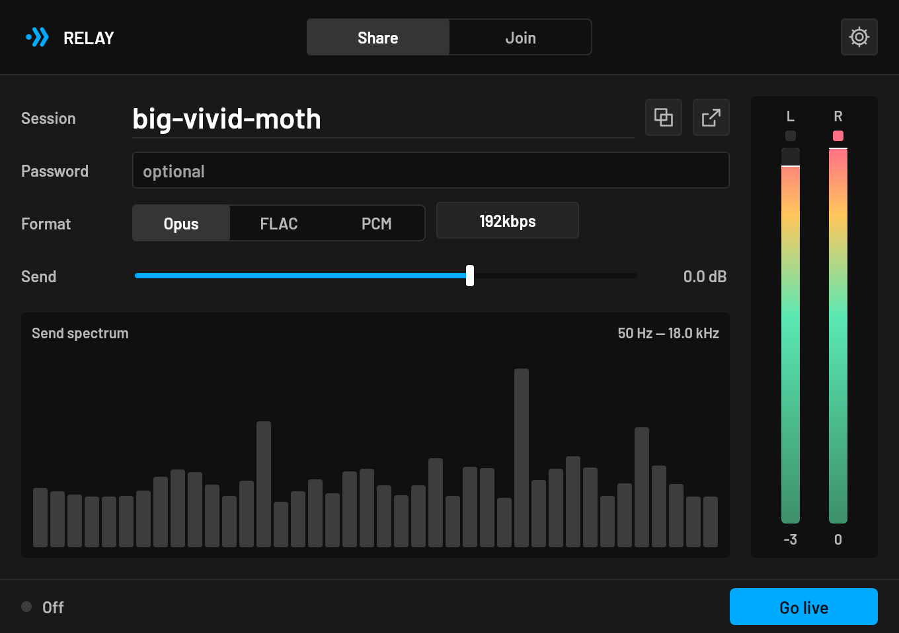

# RELAY



Low-latency real-time audio transport with native DAW, browser, and server adapters.

**Open source** under [MPL-2.0](LICENSE). Source: [github.com/DerpcatMusic/relay](https://github.com/DerpcatMusic/relay).

## Status

The Phase 0 foundation, deterministic testkit, generated protocol consumers, golden contract tests, bootstrap policy, and local CI gates are implemented. The Phase 1 audio primitives and composed `relay-audio` path are also implemented and locally gated: bounded realtime rings, scheduled-playout clock recovery, RTP sequence reordering, fixed/adaptive Rubato resampling, a safe libopus boundary, loopback, 60-second media, finite drain, and the 12-virtual-hour soak. Phase 0 still requires a tracked Git baseline and hosted Linux/Windows/macOS CI; Phase 1 still requires a final callback-safety audit and locked workspace/platform runs. Native unpaid Connect and Stream work on localhost and the home LAN through `relay-session`, the CLIs, and the Truce plugin. **LAN is 5 ms uncompressed PCM** (no Opus). Named-session listen is live at [https://relay.matari-audio.com](https://relay.matari-audio.com). Download: [matari-audio.com/relay](https://matari-audio.com/relay). Test recipes: [`apps/plugin/README.md`](apps/plugin/README.md). Paid TURN, billing, and hosted three-OS CI remain open. Plugin→browser listen is P2P through `relay-transport` + libdatachannel: sendonly Opus audio track, Cloudflare STUN, no TURN (libnice when linked; STUN-only on juice).

- [Master architecture/specification](docs/plans/2026-08-15-relay-master-plan.md)
- [Focused implementation plan index](docs/plans/README.md)
- [Phase 0 foundation plan](docs/plans/2026-08-15-relay-phase-0-foundation-plan.md)
- [Phase 0 integration evidence](docs/research/phase-0-integration.md)
- [Task research contract](docs/research/README.md)

## Current workspace

```text
crates/relay-domain/   dependency-free domain vocabulary and V1 audio profile
crates/relay-protocol/ generated Rust protocol consumer and golden fixture test
crates/relay-testkit/  deterministic fake clock and audio source/sink
crates/relay-rt/       bounded callback-safe SPSC audio sample rings
crates/relay-clock/    scheduled-playout drift estimation and recovery control
crates/relay-jitter/   bounded RTP sequence reorder and target-delay policy
crates/relay-resample/ fixed, adaptive, and finite-stream sample-rate conversion
crates/relay-opus*/    safe fixed-profile Opus facade and quarantined FFI
proto/relay/v1/        signaling, capabilities, and sanitized telemetry contracts
packages/protocol/     generated TypeScript protocol consumer and golden test
packages/web-rtc/      framework-independent browser-session shell
apps/connect/          standalone Connect CLI (`listen` / `join`)
apps/stream/           unpaid local Stream CLI (`hub` / `publish` / `listen`)
apps/plugin/           Truce adapter — CLAP, VST3, VST2, LV2, AU v2/v3, standalone (own Cargo workspace)
apps/web/              Astro product page and listen hand-off
docs/adr/              accepted foundation decisions
docs/research/         per-task sources, corrections, and validation evidence
```

## Validation

```bash
cargo fmt --all -- --check
cargo check --workspace --all-targets --all-features --locked
cargo test --workspace --all-targets --all-features --locked
cargo clippy --workspace --all-targets --all-features --locked -- -D warnings
cargo nextest run --locked

npx --yes pnpm@11.22.0 install --frozen-lockfile
npx --yes pnpm@11.22.0 -r run typecheck
npx --yes pnpm@11.22.0 -r run build

cd proto
npx --yes @bufbuild/buf lint
npx --yes @bufbuild/buf build
```

Every implementation task must create or update its own research evidence record and explicitly list potential corrections to the master plan.

## Plugin formats

```bash
cd apps/plugin
cargo truce install                 # CLAP + VST3 + VST2 + LV2 + AU (macOS) + standalone
cargo truce install --lv2 --vst2    # subset
```

AU v2/v3 need macOS. AUv3 also needs Xcode (`cargo truce install --au3`). AAX is optional and needs the Avid SDK. See [apps/plugin/README.md](apps/plugin/README.md) and [CONTRIBUTING.md](CONTRIBUTING.md).

## License

Mozilla Public License 2.0. You can use, modify, and distribute RELAY; files you change stay under MPL-2.0 so improvements can flow back. The complete text is in [LICENSE](LICENSE).
