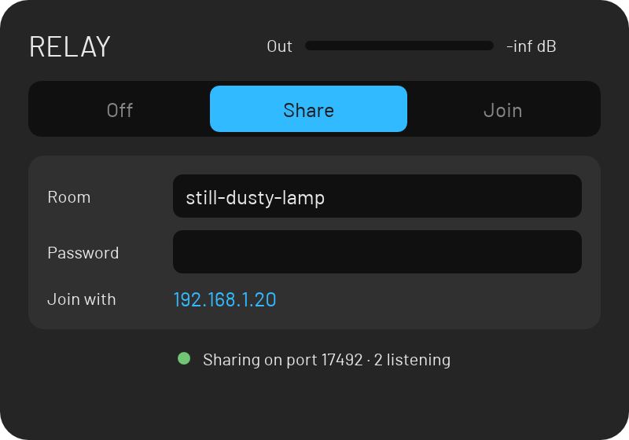

# RELAY



An insert that sends and receives the track it sits on, peer to peer. One
plugin shares a room; another joins it. Both send their DAW input and hear
the other plugin. Browser listeners hear their mix. Each source has its own
gain and mute control in the sharing plugin; turn off **THRU** for an FX return.

| To | How | Audio |
|---|---|---|
| Another RELAY on your LAN | UDP, found by room name over mDNS | 32-bit float PCM, no codec |
| Another RELAY over the internet | WebRTC | Opus, 192 kbps default ceiling, self-sizing jitter buffer |
| Anyone's browser | `relay.matari-audio.com/<room>` | Opus, 192 kbps default ceiling, nothing to install |

No account. The only server is a Cloudflare Durable Object that introduces
the two ends; audio never passes through it. LAN PCM is currently unencrypted;
see the [protocol and security notes](docs/protocol.md).

Open source under [MPL-2.0](LICENSE).

## Layout

```text
core/            relay-core: shared state, LAN link, WebRTC, mDNS, port mapping, playout
plugin/          relay-plugin: MOOSE CLAP/VST3/AU insert, MUI editor
apps/relay-web/  signaling worker (Durable Object) and the browser listen page
apps/web/        matari-audio.com/relay product page (Astro)
```

## Build and test

```bash
cargo test --workspace
cargo clippy --workspace --all-targets -- -D warnings
cargo install --git https://github.com/Matari-Audio/moose cargo-moose --locked
cargo moose install --clap --vst3        # from plugin/; add --au2 on macOS
pnpm install && pnpm -r test && pnpm -r build
```

`cargo test -p relay-plugin` also renders the editor to
`$TMPDIR/relay-editor-{share,join,about}.png`, so you can look at it without a DAW.

## Deploying signaling

`apps/relay-web` deploys with `wrangler deploy`. TURN is **disabled by default**:
only direct P2P connections and free STUN discovery are offered. Existing
secrets or `EXTRA_ICE` do not enable relaying.

To deliberately enable TURN, set `vars.TURN_ENABLED` to the string `"true"`
in `apps/relay-web/wrangler.jsonc` and deploy. Configure `TURN_KEY_ID` and
`TURN_KEY_TOKEN` secrets for Cloudflare Realtime TURN, or `EXTRA_ICE` (JSON)
for a self-hosted relay. Relayed traffic may incur charges. Set the flag back
to `"false"` and deploy to disable it; credentials already issued can remain
valid until their 24 h expiration.

Without TURN, some restrictive NATs/firewalls prevent internet connections.
LAN is unaffected.

New plugin instances default to a 192 kbps internet quality ceiling (64, 128,
192 or 510 kbps). Saved quality settings keep their positions; the former
256 kbps step now uses 192 kbps. The ceiling adapts down for slower listeners.
At 192 kbps, encoded music uses about 86.4 MB per listener-hour before network
headers, 62% less than 510 kbps. Direct P2P audio uses the host's upload and
listener's download, with no Cloudflare media bandwidth charge.

For connection troubleshooting, run `await relayDiagnostics()` in the listen
page's browser console. It reports setup milestones, selected candidate types,
RTT, audio jitter, average jitter-buffer delay and packet loss locally. RTT is
a round trip and jitter-buffer delay is one component of playback latency;
neither measures total one-way audio latency. Diagnostics are not uploaded.

## License

Mozilla Public License 2.0; see [LICENSE](LICENSE).
